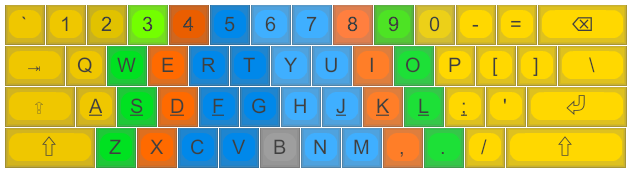

# dotfiles

[WSL Neovim Clipboard Setup (only init.lua)](https://www.youtube.com/watch?v=bn2n5SKx9Dc)

[Rewriting my neovim config so It's super based.](https://www.youtube.com/watch?v=xGkL2N8w0H4)

My keyboard layout inspired by [The Symmetric Typing Project](https://kennetchaz.github.io/symmetric-typing/)
